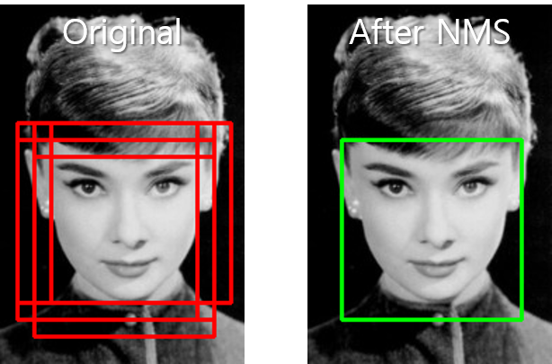

# Object Detection using Deep Learning

<br>

 딥러닝을 이용한 Ojbect Detection에 대한 대표 Architecture들을 공부하기 위한 문서입니다.

<u>개인적으로 공부하면서 참고가 되었던 정리가 잘 된 Article들을 정리해 두었습니다</u>. 물론 발표된 논문도 중요합니다 :)

내용 구성은 간단합니다.


```
[Architecture 이름 / 발표된 년도 / 구현해볼 수 있는 Code]

[Paper url]

[정리가 잘 되어있는 Articles]
```


출처: https://github.com/hoya012/deep_learning_object_detection

Hoya012 님께서 친절하게 정리해주신 Object Detection Arcitecture 탄생 순서입니다. 

**빨간색**으로 처리된 것들은 핵심 Architecture들로 꼭 보고 가시는 것이 좋습니다.

------


 - **R-CNN (2014)** [code - Keras]
    <br/>[[Paper]](https://arxiv.org/abs/1311.2524) Rich feature hierarchies for accurate object detection and semantic segmentation
    <br/>[[Article]](https://junn.net/archives/2517) Image Segmentation에 대한 짧은 이야기: R-CNN 에서부터 Mask R-CNN까지

- **Fast R-CNN (2015)** [code - Keras]
  <br/>[[Paper]](https://arxiv.org/abs/1504.08083) Fast R-CNN 
  <br/>[[Article]](http://openresearch.ai/t/fast-r-cnn/240) Fast R-CNN | OpenResearch.ai
  <br/>[[Article]](https://github.com/deepsense-ai/roi-pooling) RoI pooling in TensorFlow
- **Faster R-CNN (2016)** [[code - Keras]](https://github.com/kbardool/keras-frcnn) by kbardool
  <br/>[[Paper]](https://arxiv.org/abs/1506.01497) Faster R-CNN: Towards Real-Time Object Detection with Region Proposal Networks
  <br/>[[Article]](http://incredible.ai/deep-learning/2018/03/17/Faster-R-CNN/) What is Faster R-CNN | Incredible.AI
  <br/>[[Article]](https://curt-park.github.io/2017-03-17/faster-rcnn/) [분석] Faster R-CNN 
  <br/>[[Article]](https://towardsdatascience.com/faster-r-cnn-object-detection-implemented-by-keras-for-custom-data-from-googles-open-images-125f62b9141a) Faster R-CNN (object detection) implemented by Keras for custom data from Google’s Open Images Dataset V4
  <br/>[[Article]](https://tryolabs.com/blog/2018/01/18/faster-r-cnn-down-the-rabbit-hole-of-modern-object-detection/) Faster R-CNN: Down the rabbit hole of modern object detection
  <br/>[[Article]](https://zzsza.github.io/data/2018/05/09/Faster-RCNN-review/) Faster R-CNN 논문 리뷰
  <br/>[[Code]](https://github.com/RockyXu66/Faster_RCNN_for_Open_Images_Dataset_Keras) Faster R-CNN for Open Images Dataset by Keras
  <br/>[[Code]](https://github.com/kbardool/keras-frcnn) keras-frcnn
- **YOLO (2016)** [code - Keras]
  <br/>[[Paper]](https://arxiv.org/abs/1506.02640) You Only Look Once: Unified, Real-Time Object Detection
  <br/>[[Article]](https://curt-park.github.io/2017-03-26/yolo/) [분석] YOLO
  <br/>[[Article]](https://arclab.tistory.com/167) [논문 요약12] You Only Look Once: Unified, Real-TIme Object Detection
- **SSD (2016)** [[code - Keras]](https://github.com/pierluigiferrari/ssd_keras) by pierluigiferrari
  <br/>[[Paper]](https://arxiv.org/abs/1512.02325) SSD: Single Shot MultiBox Detector 
  <br/>[[Article]](http://openresearch.ai/t/ssd-single-shot-multibox-detector/74) SSD: Single Shot Multibox Detector | OpenResearch.ai
  <br/>[[Article]](https://taeu.github.io/paper/deeplearning-paper-ssd/) [논문] SSD: Single Shot Multibox Detector 분석
  <br/>[[Article]](https://medium.com/@jonathan_hui/what-do-we-learn-from-single-shot-object-detectors-ssd-yolo-fpn-focal-loss-3888677c5f4d) What do we learn from single shot object detectors (SSD, YOLOv3), FPN & Focal loss (RetinaNet)?
- **R-FCN (2016)** [[code - Keras]](https://github.com/parap1uie-s/Keras-RFCN) by parap1uie-s
  <br/>[[Paper]](https://arxiv.org/abs/1605.06409v2) R-FCN: Object Detection via Region-based Fully Convolutional Networks
- **RetinaNet (2017)** [[code - Keras]](https://github.com/fizyr/keras-retinanet) by fizyr
  <br/>[[Paper]](https://arxiv.org/abs/1708.02002) Focal Loss for Dense Object Detection
  <br/>[[Article]](https://towardsdatascience.com/review-retinanet-focal-loss-object-detection-38fba6afabe4) Review: RetinaNet - Focal Loss (Object Detection)
- **Mask R-CNN (2017)** [[code - Keras]](https://github.com/matterport/Mask_RCNN) by matterport
  <br/>[[Paper]](https://arxiv.org/abs/1703.06870) Mask R-CNN 


# Object Tracking 

tbd :open_mouth:

---


# 정리가 잘 되어있는 갓블로그

- **HOYA012'S RESEARCH BLOG** [[Link]](https://hoya012.github.io/)
<br/>Object Detection관련 논문들 리뷰가 잘 되어있음

- **Hello Blog** [[Link]](https://curt-park.github.io/)
<br/>Deep Learning 관련 논문 및 이론 정리가 잘 되어있음

- **어쩐지 오늘은** [[Link]](https://zzsza.github.io/)
<br/>Kaggle, Machine Learning 등 여러가지 지식들을 잘 설명해줌

- **Papers With Code** [[Link]](https://paperswithcode.com/)
<br/>각 분야별 최신 논문들을 코드와 함께 소개해주는 블로그로
<br/>Image Classification, Object Detection, Tracking, NLP 등 각 분야들의 State-of-the-art 논문들과 지표를 잘 정리해놓음


# CNN Architecture에서 사용된 핵심 기법들


### NMS(non-maximum suppression)

 Object Detection을 구현하다보면 하나의 object에 여러개의 detection이 가능하여 정확도가 떨어질 수 있다. 따라서 하나의 object에 가장 확률이 높은 detection을 찾아주는 기법이 NMS 알고리즘이다.



[[Article]](https://heiwais25.github.io/machinelearning/cnn/2018/05/10/non-maximum-suppression/) Non-Maximum Suppression
<br/>[[Article]](https://dyndy.tistory.com/275) NMS (non-maximum-suppression)
<br/>[[Article]](https://docs.google.com/presentation/d/1aeRvtKG21KHdD5lg6Hgyhx5rPq_ZOsGjG5rJ1HP7BbA/pub?start=false&loop=false&delayms=3000&slide=id.g137784ab86_4_4448) YOLO - deepsystems.io

---

### IOU (Intersection of Union)

 tbd 😆

---


